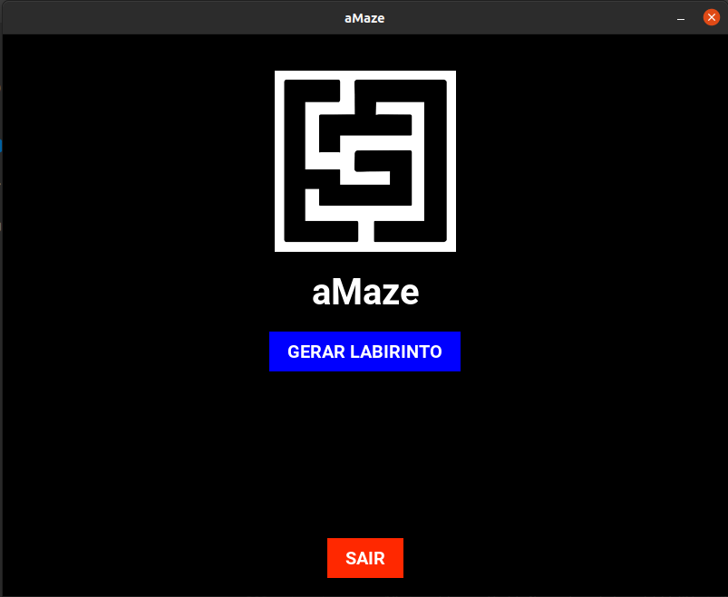
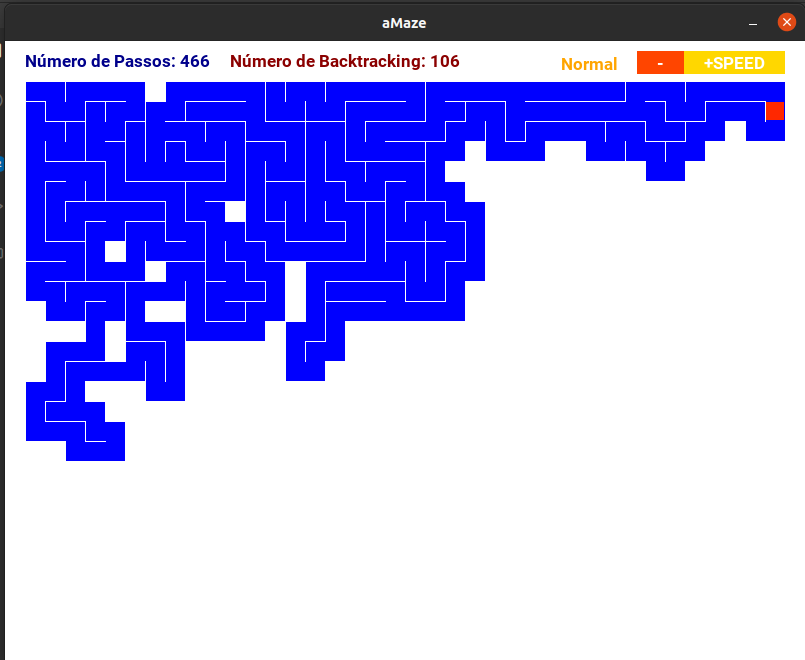
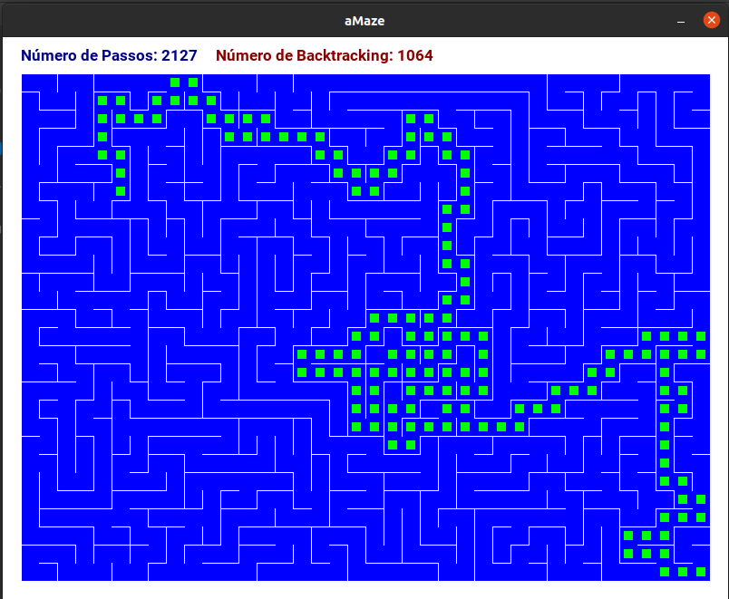
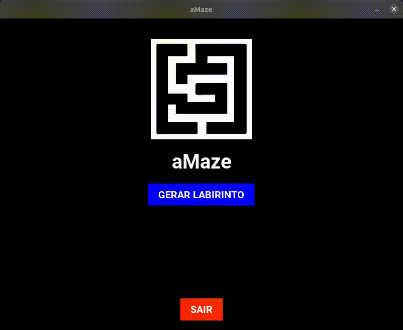

# aMaze

**Número da Lista**: 1<br>
**Conteúdo da Disciplina**: Grafos 1<br>

## Alunos
| Matrícula | Aluno |
| -- | -- |
| 18/0033620 |  [João Henrique Paulino](https://github.com/JoaoHenrique12) |
| 17/0013812 |  [Matheus Rodrigues](https://github.com/rjoao) |

## Sobre 

O objetivo do projeto é possibilitar a visualização da geração de labirintos utilizando o algoritmo de Busca em Profundidade (DFS - Depth First Search).

O algoritmo é aplicado sobre o grafo abstraído do grid da tela. Nesse grafo, cada componente do grid é um vértice e os componentes ao lado (direito e esquerdo), acima e abaixo, se existirem, são os vértices vizinhos. A parede do labirinto representa os componentes que, após a aplicação do algoritmo, não possuem conexão.

É possível separar o projeto em:
 - Geração do labirinto
    - Visualização das etapas em diferentes velocidades;
    - Contagem dos passos do algoritmo;
    - e Contagem dos passos de Backtracking realizados.
 - Apresentação da solução do labirinto
    - Visualização em etapas.

## Screenshots

### Tela Inicial


### Geração do Labirinto


### Solução do Labirinto


## Vídeo


**[Versão MP4](./assets/media/video.mp4)** 

## Instalação 

**Linguagem**: Python3<br>

É necessário possuir o sistema de gerenciamento de pacotes **pip3**.

Se não possuir, no Ubuntu, rode o seguinte comando no terminal:

```
sudo apt-get install python3-pip
``` 

## Uso 

No terminal, primeiro instale os requisitos do projeto e depois execute o arquivo principal.

### Instalação dos requisitos

```
make install
```

### Execução do projeto

```
make run
```

## Outros 

O [enunciado](./base/enunciado.pdf) foi criado por um dos membros da dupla ([João Henrique](https://github.com/JoaoHenrique12)) para os alunos de Estrutura de Dados 1.

Esse enunciado foi utilizado como base para o desenvolvimento desse projeto.
